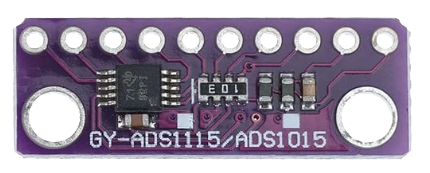

<p align="center"></p>
<h1 align="center">How to Use ADS1x15 With the Raspberry Pi</h1> 
<h4 align="right">Month 24</h4>


<br>

# Table of contents
- [Table of contents](#table-of-contents)
- [Install on Python](#install-on-python)
  - [Uso de un LM35 en el](#uso-de-un-lm35-en-el)
- [Troubleshooting](#troubleshooting)

<br>

El módulo se llama ADS1015/ADS1115 porque puede configurarse como uno o como el otro. Cuando se configura como ads1015 su resolución es de 12-bit y cuando se configura como ads1115 su resolución es de 16-bit. La ganancia es de 1 por default, y si cambiamos la ganancia afectara la precisión. El código esta resumido el detalle con si variamos la ganancia. 


# Install on Python
1. Habilitar I2C en Raspberry Pi:
Ejecuta sudo raspi-config. Selecciona Interfacing Options y luego selecciona I2C. Habilita el I2C. Reinicia la Raspberry Pi con sudo reboot.

2. Instalar herramientas de I2C:
Para verificar que el módulo RTC esté correctamente conectado, instala las herramientas de I2C.
```bash
sudo apt-get update && sudo apt-get full-upgrade
sudo apt-get install i2c-tools
sudo reboot
```
3. Verificar direccion del ADS1x15 (typically 0x48):
Ejecuta el siguiente comando para asegurarte de que la Raspberry Pi detecta el dispositivo:
```
sudo i2cdetect -y 
```

1. Livbrerias 
```bash
sudo pip install adafruit-circuitpython-ads1x15
sudo pip install board
sudo pip install adafruit-blinka
```
<br>

```ads1x15-python.py``` con esta app podemos ver la ADC de los 4 canales:
```python
# sudo pip install adafruit-circuitpython-ads1x15
# sudo pip install board
# sudo pip install adafruit-blinka

"""
El ADS1115 tiene diferentes configuraciones de ganancia (PGA - Programmable Gain Amplifier) 
que determinan el rango máximo de entrada. 
Choose a gain of 1 for reading voltages from 0 to 4.09V.
Or pick a different gain to change the range of voltages that are read:
  - 2/3 = +/-6.144V
  -   1 = +/-4.096V
  -   2 = +/-2.048V
  -   4 = +/-1.024V
  -   8 = +/-0.512V
  -  16 = +/-0.256V

Para medir voltajes de hasta 5V, debes establecer la ganancia en 2/3, que te permitirá medir hasta ±6.144V. 
Ten en cuenta que, aunque esta ganancia permite un rango más amplio, reduce la resolución efectiva del ADC
 para valores más pequeños.

ads.gain = 2/3 establece la ganancia para permitir la medición de voltajes hasta ±6.144V. 
Esto asegura que puedas medir valores hasta 5V.

Precisión: Ajustar la ganancia a 2/3 disminuirá la precisión en voltajes más bajos. 
Si solo necesitas medir temperaturas comunes (por ejemplo, de 0 a 100°C), 
puedes usar una ganancia menor, como 1 (±4.096V).

Note you can change the I2C address from its default (0x48), and/or the I2C

"""

import time
import board
import busio
import adafruit_ads1x15.ads1015 as ADS
from adafruit_ads1x15.analog_in import AnalogIn

# Create the I2C bus
i2c = busio.I2C(board.SCL, board.SDA)

# Create the ADC object using the I2C bus
ads = ADS.ADS1015(i2c)
ads.gain = 1

# Create single-ended input on channel 0, 1, 2, and 3
chan0 = AnalogIn(ads, ADS.P0)
chan1 = AnalogIn(ads, ADS.P1)
chan2 = AnalogIn(ads, ADS.P2)
chan3 = AnalogIn(ads, ADS.P3)

# Print title for columns
print("{:>5}\t{:>5}\t{:>5}\t{:>5}\t{:>5}\t{:>5}\t{:>5}\t{:>5}".format(
    'Raw 0', 'V 0', 'Raw 1', 'V 1', 'Raw 2', 'V 2', 'Raw 3', 'V 3'))

while True:
    # Print raw and voltage readings for all channels
    print("{:>5}\t{:>5.3f}\t{:>5}\t{:>5.3f}\t{:>5}\t{:>5.3f}\t{:>5}\t{:>5.3f}".format(
        chan0.value, chan0.voltage, 
        chan1.value, chan1.voltage,
        chan2.value, chan2.voltage,
        chan3.value, chan3.voltage))
    time.sleep(0.5)

```

## Uso de un LM35 en el 

```ads1x15-lm35```

```python
"""
El ADS1115 tiene diferentes configuraciones de ganancia (PGA - Programmable Gain Amplifier) que determinan el rango máximo de entrada. 
Aquí están las configuraciones más comunes:

1 = ±4.096V (default)
2/3 = ±6.144V
2 = ±2.048V
4 = ±1.024V
8 = ±0.512V
16 = ±0.256V

Para medir voltajes de hasta 5V, debes establecer la ganancia en 2/3, que te permitirá medir hasta ±6.144V. Ten en cuenta que, aunque esta ganancia permite un rango más amplio, reduce la resolución efectiva del ADC para valores más pequeños.

ads.gain = 2/3 establece la ganancia para permitir la medición de voltajes hasta ±6.144V. Esto asegura que puedas medir valores hasta 5V.

Precisión: Ajustar la ganancia a 2/3 disminuirá la precisión en voltajes más bajos. Si solo necesitas medir temperaturas comunes (por ejemplo, de 0 a 100°C), 
puedes usar una ganancia menor, como 1 (±4.096V).

Alimentación: Asegúrate de que el LM35 esté alimentado correctamente con 5V

"""

import time
import board
import busio
import adafruit_ads1x15.ads1115 as ADS
from adafruit_ads1x15.analog_in import AnalogIn

# Configurar la comunicación I2C
i2c = busio.I2C(board.SCL, board.SDA)

# Crear el objeto ADS usando I2C y ajustar la ganancia para medir hasta 6.144V
ads = ADS.ADS1115(i2c)
ads.gain = 2/3  # Configurar ganancia para medir voltajes entre 0-5V (rango completo ±6.144V)

# Crear un canal de entrada analógica (conectado al pin A0 del ADS1115)
chan = AnalogIn(ads, ADS.P0)

# Función para convertir la lectura del LM35 a grados Celsius
def lm35_to_celsius(voltage):
    # El LM35 proporciona 10mV por cada grado Celsius.
    # Multiplicamos el voltaje por 100 para obtener la temperatura en grados Celsius.
    return voltage * 100

try:
    while True:
        # Leer el voltaje en el canal A0
        voltage = chan.voltage
        
        # Convertir el voltaje a temperatura
        temperature = lm35_to_celsius(voltage)
        
        # Mostrar la temperatura
        print(f"Temperatura: {temperature:.2f}°C (Voltaje: {voltage:.4f} V)")
        
        # Esperar 1 segundo antes de la siguiente lectura
        time.sleep(1)

except KeyboardInterrupt:
    print("Lectura interrumpida por el usuario.")

```

> :memo: **Note:* el pin Vcc del LM35 va a 5V


<br>

# Troubleshooting
> :warning: **Warning:** Connect the VDD pin of the ADS1115 to one of the 3.3V pins on the Raspberry Pi. El VCC del ADS1x15 es solo 3.3V


more info: https://www.instructables.com/How-to-Use-ADS1115-With-the-Raspberry-Pi-Part-1/

<br>

---
Copyright &copy; 2022 [carjavi](https://github.com/carjavi). <br>
```www.instintodigital.net``` <br>
carjavi@hotmail.com <br>
<p align="center">
    <a href="https://instintodigital.net/" target="_blank"></a>
</p>


